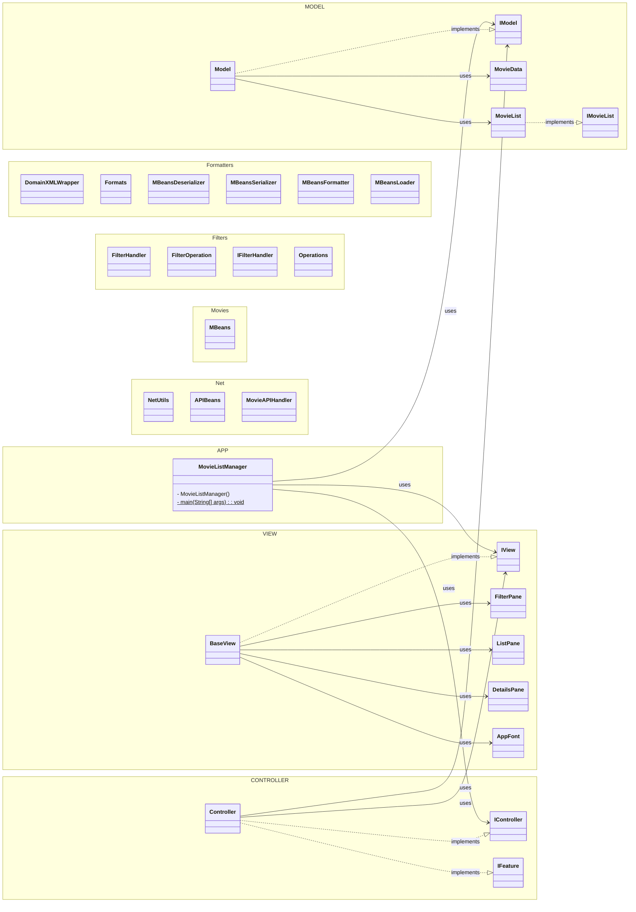

# Movie List Manager: Final Design UML Class Diagram

```mermaid
classDiagram
    direction LR

    namespace MODEL {
        class IModel
        class Model
        class IMovieList
        class MovieData
        class MovieList

    }

    namespace VIEW {
        class IView
        class BaseView
        class FilterPane
        class ListPane
        class DetailsPane
        class AppFont
    }

    namespace CONTROLLER {
        class IController
        class Controller
        class IFeature
    }

    namespace Formatters {
        class DomainXMLWrapper
        class Formats
        class MBeansDeserializer
        class MBeansSerializer
        class MBeansFormatter
        class MBeansLoader
    }

    namespace Filters {
        class FilterHandler
        class FilterOperation
        class IFilterHandler
        class Operations
    }

    namespace Movies {
        class MBeans
    }

    namespace Net {
        class NetUtils
        class APIBeans
        class MovieAPIHandler
    }
    
    namespace APP {
        class MovieListManager
    }
    
    MovieListManager --> IModel: uses
    MovieListManager --> IView: uses
    MovieListManager --> IController: uses
    
    Model ..|> IModel: implements
    BaseView ..|> IView: implements
    Controller ..|> IController: implements
    Controller ..|> IFeature: implements
    MovieList ..|> IMovieList: implements
    
    Model --> MovieData: uses
    Model --> MovieList: uses
    
    Controller --> IModel: uses
    Controller --> IView: uses
    
    BaseView --> FilterPane: uses
    BaseView --> ListPane: uses
    BaseView --> DetailsPane: uses
    BaseView --> AppFont: uses
    
    
    class MovieListManager { 
        - MovieListManager()
        - main(String[] args): void$
    }
    
    class IModel {
        
    }
    
    
```