## GUI Testing

---
### Filter Pane
##### Expected Behavior:

- Apply Filters button filters the selected tab in the List Pane
- Clear Filters button removes filters from the List Pane, and removes text/options from Filter Pane fields
  (except for range filters)
- All filters maintain data when focus is lost
- Range filters that are empty reset to their respective min/max value when focus is lost
- Range filters clear when focus is gained
- The Box Office Earnings range filter formats user entered data into millions of dollars when focus is lost
- Range filters refresh to reflect max and min values when movies are removed from the selected list in the List Pane
- All filter selections clear when a new tab is selected
- When movies from the current tab in the List Pane are removed, their corresponding options are removed from dropdown
  filters
- Movies without Box Office Earnings data display N/A in the Box Office Earnings range filter
---

### List Pane
##### Main Table:
- On Tab Change
  - Filters in the Filter Pane will be cleared
  - Table selection will be cleared
  - Active tab will show all records, unfiltered
  - Export List and Delete List buttons will be...
    - Disabled in source list
    - Enabled in user-defined lists
- On Table Selection
  - The selected row will be highlighted
  - Details Pane will display the selected movie's details
- On Filter Application
  - Table selection will be cleared

##### List Management Features:
- Create List (via adding to a new list in the dropdown dialogs)
  - A new tab will be created with the user-defined list name
  - The new list will contain the selected movie
- Import List
  - Opens a dialog to add the selected movie to a user-defined list
- Export List
  - Opens a dialog to export the current list to a CSV file
- Delete List
  - Opens a dialog prompting the user to confirm deletion of the current list
  - On confirmation
    - The list will be removed from the tabs
  - On cancellation, do nothing

---

### Details Pane
##### Expected Behavior:

- Watched checkbox and MyRating box greyed out/disabled when there's no record shown on details pane.
- Greyed out watched checkbox and MyRating box should not be editable or interactable.
- Activate watched checkbox and MyRating box when records starts showing and can be interact with.
- Upon resizing the window, no item or words got out of bound
---

### Test Filter Pane

---

- Test Apply Filters Button

Clicking 'Apply Filters' button filters the selected list in the center List Pane

- Test Clear Filters Button

Clicking 'Clear Filters' removes selected options in the Filter Pane and unfilters the selected movie list in the List Pane

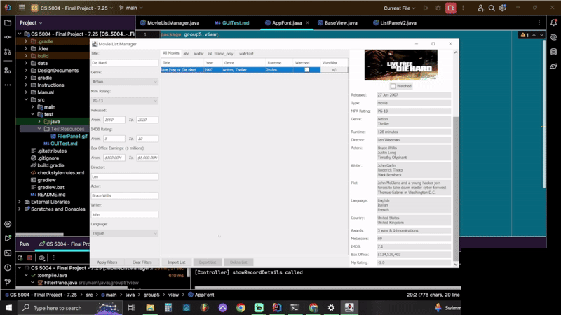

- Test Focus Lost

All filters will maintain data when focus is lost and the 'All Movies' tab is selected

Range filters display the min and max range of respective fields when focus is lost and any tab except the 'All Movies'
tab is selected. If the user enters new information, then when focus is lost the user entered data remains

Box Office Earnings filters format user entries in Millions of dollars, but allow for N/A to be entered

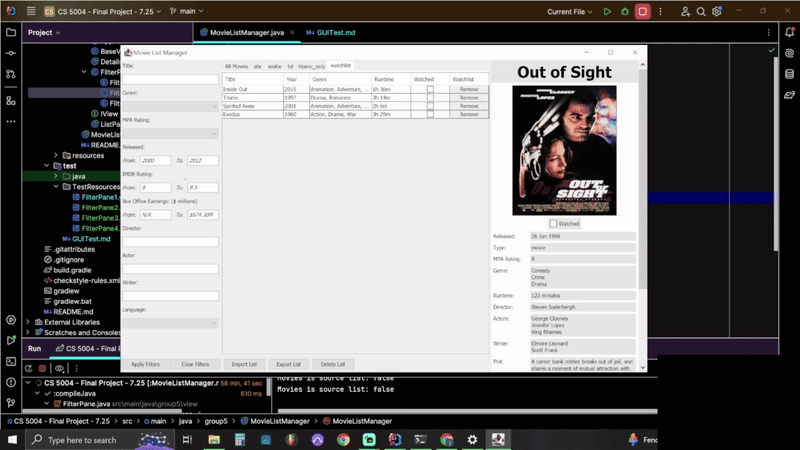

- Test Focus Gained

Range filters clear when focus is gained

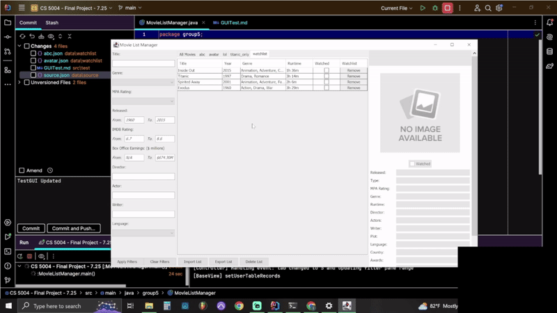

- Test Range Filters

Range Filters update to reflect min/max values of the current list when other lists are selected, but are cleared when 
the 'All Movies' or an empty movie list is selected.

Range Filters update to reflect min/max ranges when movies are removed from a list. Range filters will clear if all
movies have been removed from a movie list

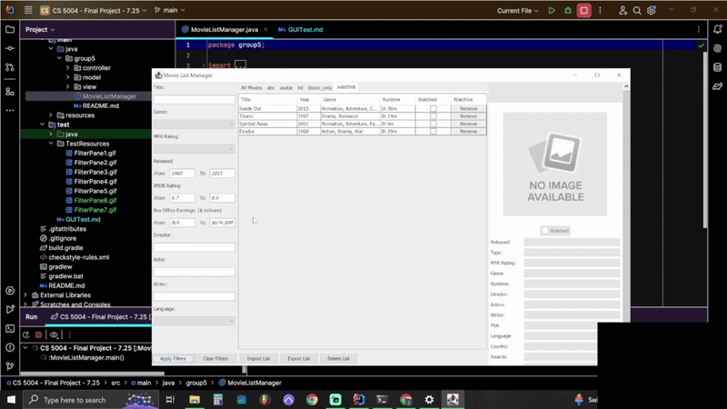

The Box Office Earnings range filters display N/A when box office data is not available for a movie

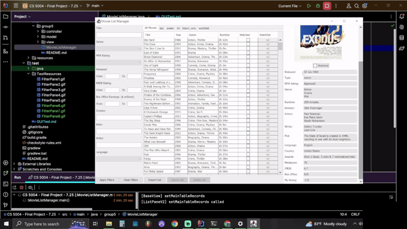
- Test Drop Down Filter Options

Removing movies in a movie list will remove corresponding options from respective dropdown filters

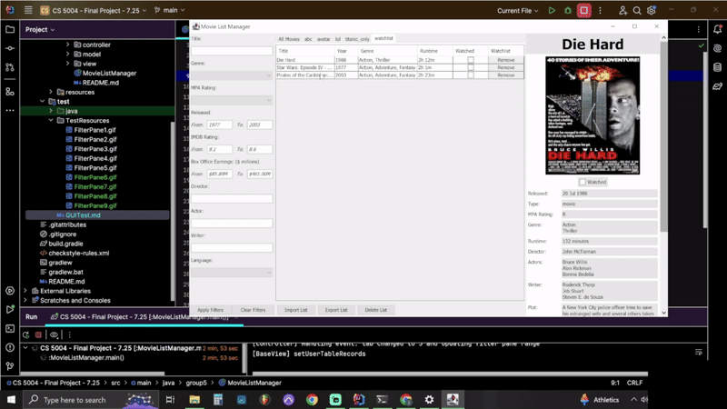

- Test Navigating Movie Lists

All filter selections clear when a new watchlist is selected

### Test Details Pane

- Test Basic Functionality

Details Pane is blank at startup with a 'No Image Available' label in place of a movie poster. Once a movie in any list
is clicked, that movies' details populate in the Details Pane

User inputted fields ('Watched' checkbox and 'My Rating') are not editable when a movie is not selected, but become 
editable once a movie is selected. Similarly, the 'Watched' checkbox is greyed out until a movie is selected

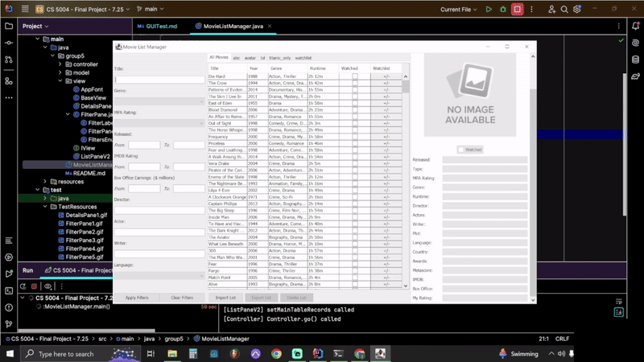

Checking the 'Watched' checkbox updates the corresponding box in the List Pane

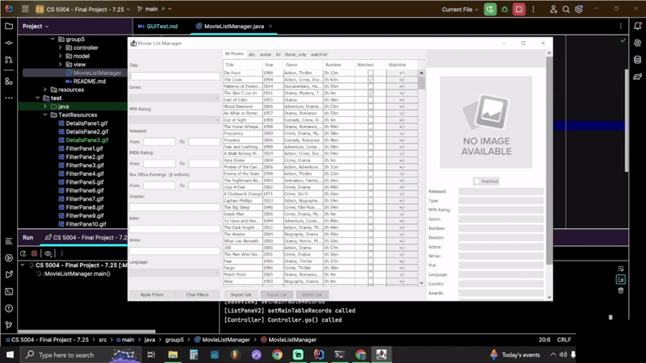

Changes to the 'Watched' and 'My Rating' fields are saved and remain even if the app is closed and restarted

- Test Focus Gained

'My Rating' field clears when clicked

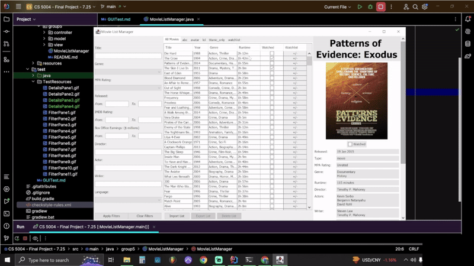

- Test Focus Lost

'My Rating' field reverts to 'Enter your rating here (0 - 10)' if user does not enter information.
If user has entered information 'My Rating' fields reverts back to users input when focus is lost

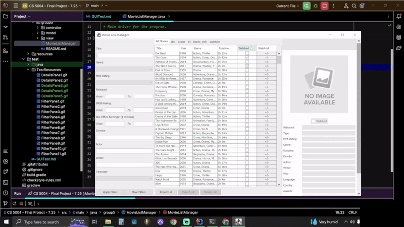

### Test List Pane

- Test Basic Functionality

Clicking on a movie in the List Pane will trigger the Details Pane to display information for that movie. The table row
containing the clicked movie will also highlight

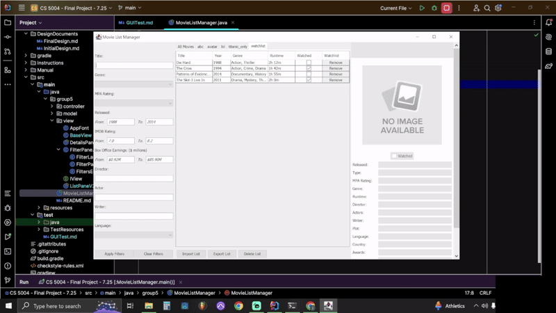

Clicking the 'Watched' checkbox in the List Pane will check the corresponding checkbox in the Details Pane

Clicking the header of any column (except for the 'Watchlist' column) will sort the table by the clicked column in
ascending order, and if clicked again will sort the table by that column in descending order

Clicking the 'Remove' button in the right-most column of a movie list will remove that movie from that movie list. This
change will persist after the app is closed and reopened

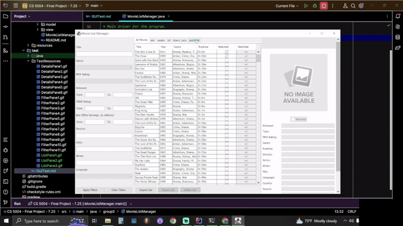

- Test 'All Movies' Source Tab

Clicking the '+/-' in the right-most column triggers a popup enabling users to add or remove movies from/to a movie list
If a movie is already in a movie list, then it will be checked in the popup menu. If a movie is not in a list, it will 
be unchecked in the popup menu.

Adding a movie to a movie list will make that movie appear in that list. Removing a movie from a movie list will make
that movie disappear from that list

When adding a movie, selecting 'Add To New Watchlist' will create a new tab with the user entered title of that
movie list. The movie added to that list will appear in the new list

- Test Navigating Movie Lists

Tab changes display corresponding movie lists

When a tab is clicked, the corresponding movie list will display unfiltered, meaning any existing filters will be
reverted

- Test Movie Lists

