## GUI Testing

---
### Test Filter Pane

---

- Test Apply Filters

Clicking 'Apply Filters' button filters the selected list in the center List Pane

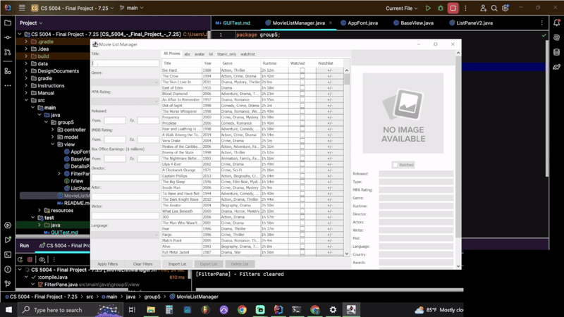

If a movie is not available in the initial data source in 'All Movies', searching for that movie by name will pull that
movie from the OMDb movies API (https://www.omdbapi.com/) and add it to the offline source list

- Test Clear Filters

Clicking 'Clear Filters' removes selected options in the Filter Pane and unfilters the selected watchlist in the List Pane

- Test Focus Lost

All filters will maintain data when focus is lost and the 'All Movies' tab is selected

Range filters display the min and max range of respective fields when focus is lost and any tab except the 'All Movies'
tab is selected. If the user enters new information, then when focus is lost the user entered data remains

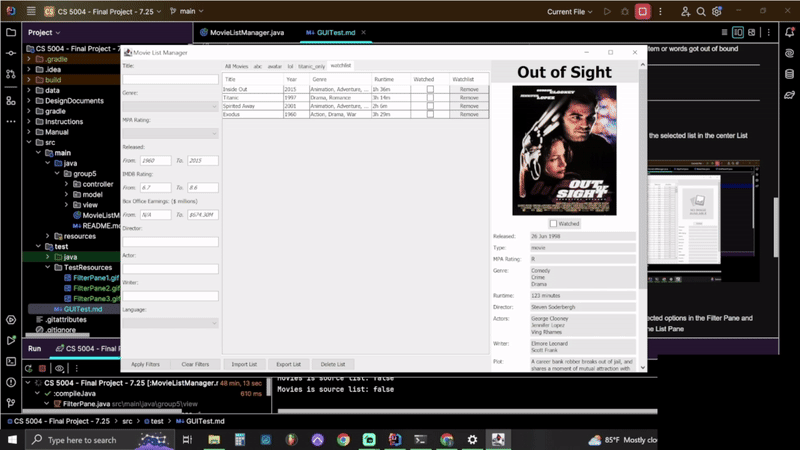

Box Office Earnings filters format user entries in millions of dollars, but allow for N/A to be entered (referring to
a movie without box office earnings data)

- Test Focus Gained

Range filters clear when focus is gained

- Test Range Filters

Range Filters update to reflect min/max values of the current list when other lists are selected, but are cleared when 
the 'All Movies' or an empty watchlist is selected.

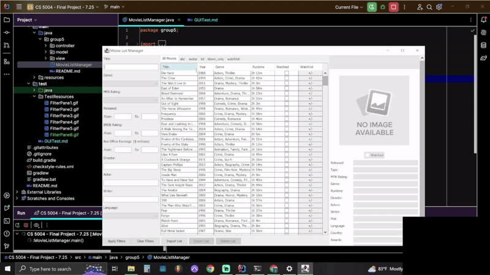

Range Filters update to reflect min/max ranges when movies are removed from a list. Range filters will clear if all
movies have been removed from a watchlist

The Box Office Earnings range filters display N/A when box office data is not available for a movie

- Test Drop Down Filter Options

Removing movies in a watchlist will remove corresponding options from respective dropdown filters

- Test Navigating Movie Lists

All filter selections clear when a new watchlist is selected

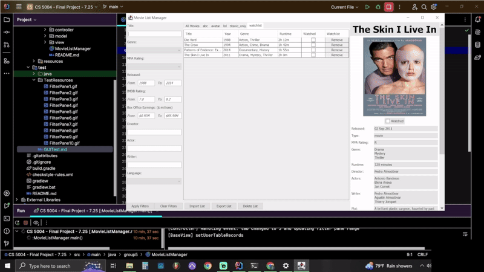

### Test Details Pane

- Test Basic Functionality

Details Pane is blank at startup with a 'No Image Available' label in place of a movie poster. Once a movie in any list
is clicked, that movies' details populate in the Details Pane

User inputted fields ('Watched' checkbox and 'My Rating') are not editable when a movie is not selected, but become 
editable once a movie is selected. Similarly, the 'Watched' checkbox is greyed out until a movie is selected

Checking the 'Watched' checkbox updates the corresponding box in the List Pane

Changes to the 'Watched' and 'My Rating' fields are saved and remain even if the app is closed and restarted

- Test Focus Gained

'My Rating' field clears when clicked

- Test Focus Lost

'My Rating' field reverts to 'Enter your rating here (0 - 10)' if user does not enter information.
If user has entered information, when focus is lost the 'My Rating' field reverts back to the users input 

### Test List Pane

- Test Basic Functionality

Clicking on a movie in the List Pane will trigger the Details Pane to display information for that movie. The table row
containing the clicked movie will also highlight

Clicking the 'Watched' checkbox in the List Pane will check the corresponding checkbox in the Details Pane

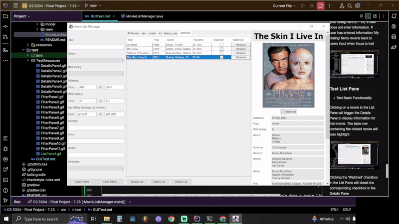

Clicking the header of any column (except for the 'Watchlist' column) will sort the table by the clicked column in
ascending order, and if clicked again will sort the table by that column in descending order

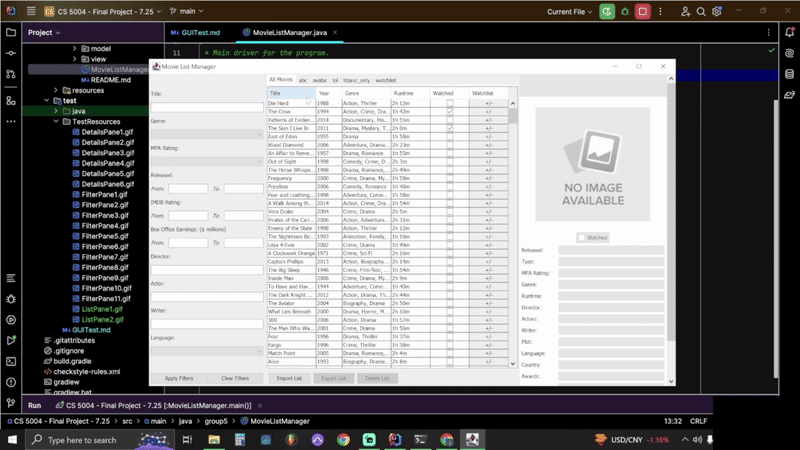

Clicking the 'Remove' button in the right-most column of a watchlist will remove that movie from that watchlist. This
change will persist after the app is closed and reopened

- Test 'All Movies' Source Tab

Clicking the '+/-' in the right-most column triggers a popup enabling users to add or remove movies to/from a watchlist.
If a movie is already in a watchlist, then it will be checked in the popup menu. If a movie is not in a list, it will 
be unchecked in the popup menu

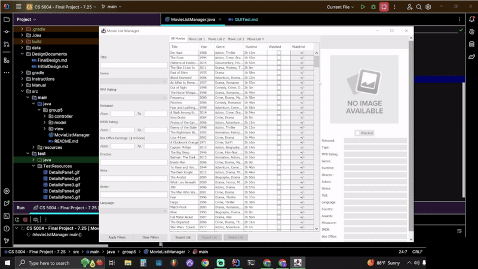

Adding a movie to a watchlist will make that movie appear in that list. Removing a movie from a watchlist will make
that movie disappear from that list

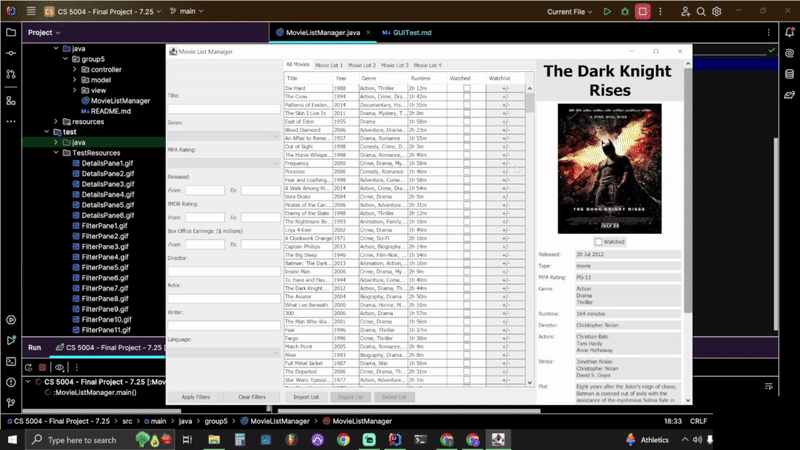

When adding a movie, selecting 'Add To New Watchlist' will create a new tab with the user entered title of that
watchlist. The movie added to that list will appear in the new list

Attempting to add a new watchlist (using the Add To New Watchlist functionality when adding a movie) with the same name
as an existing watchlist will trigger a 'Watchlist already exists' (name clash) error

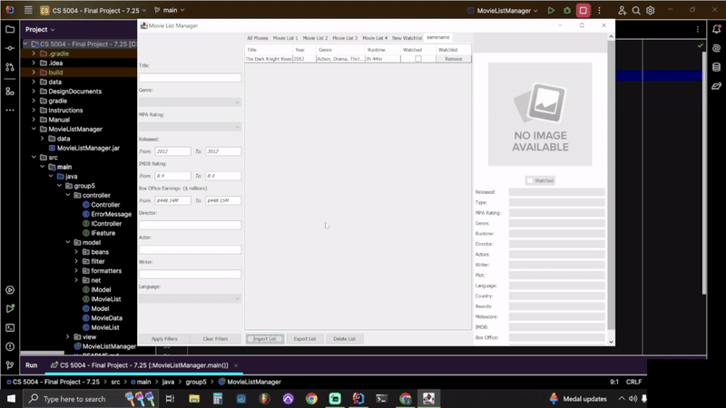

Upon startup watchlists are rearranged in alphabetical order (The 'All Movies' tab is always the first tab)

- Test Navigating Movie Lists

Tab changes display corresponding watchlists

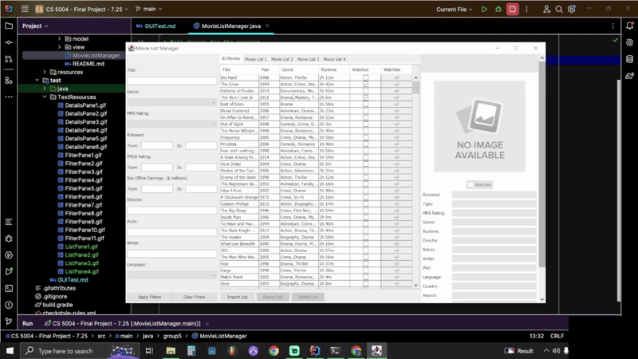

When a tab is clicked, the corresponding watchlist will display unfiltered, meaning any existing filters will be
reverted

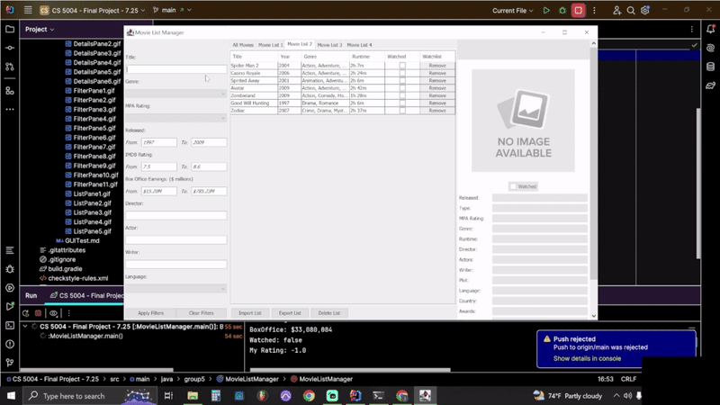

If there are more tabs than the current window can display, a navigation arrow appears in the upper right hand corner of
the watchlist tabs. Clicking the arrow increments/decrements through the tabs displayed in the tab bar

- Test Import List

Importing a watchlist using the 'Import List' button only allows importing JSON or CSV files

Test import from JSON file using the 'Import List' button

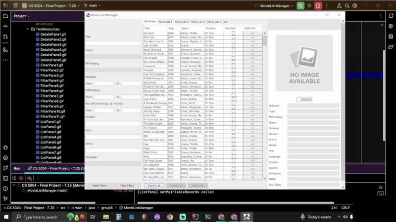

Test import from CSV using the 'Import List' button

Importing an invalid watchlist file triggers a 'Failed to create new watchlist' error

Attempting to import a file with the same name as an existing watchlist triggers a 'Watchlist already exists' 
(name clash) error

- Test Export List

Using the 'Export List' button, watchlists can only be exported in XML, JSON, CSV and TXT

Exporting a watchlist in XML generates an XML file containing details of the movies in the that watchlist

Exporting a watchlist in JSON generates an JSON file containing details of the movies in the that watchlist

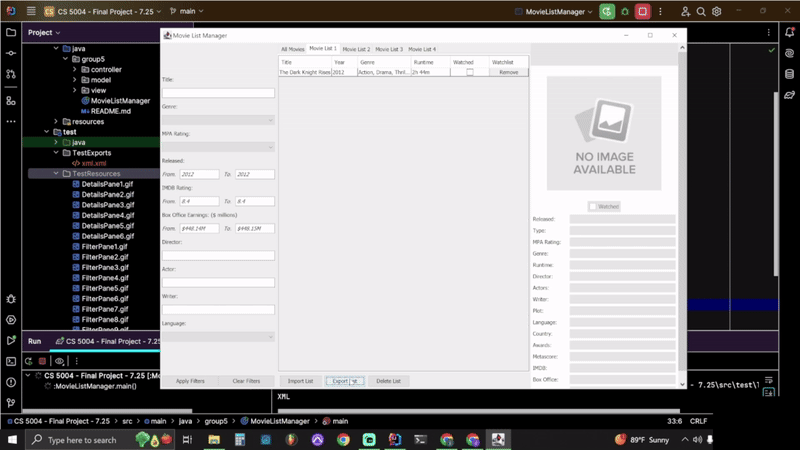

Exporting a watchlist in CSV generates an CSV file containing details of the movies in the that watchlist

Exporting a watchlist in TXT generates an TXT file containing details of the movies in the that watchlist

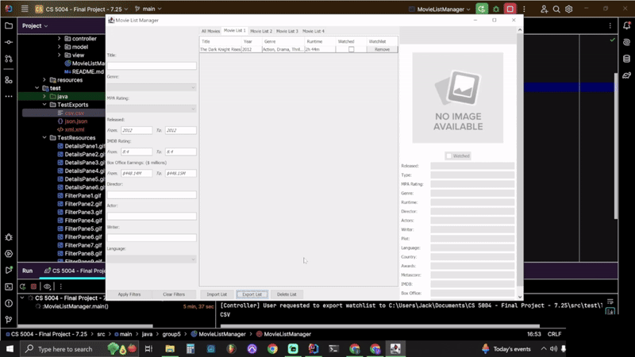

The 'All Movies' list cannot be exported using the 'Export List' button (button is greyed out)

- Test Delete List

Clicking the 'Delete List' button deletes the selected watchlist if 'Yes' is clicked in the popup. If 'No' is
clicked, the watchlist is not deleted

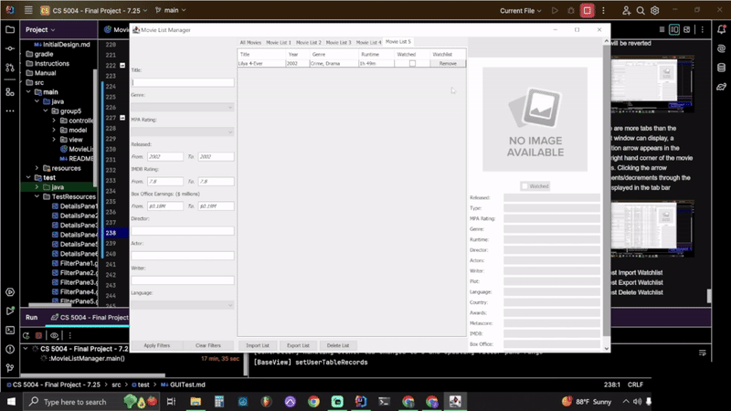

The 'All Movies' source list cannot be deleted using the 'Delete List' button (button is greyed out)

